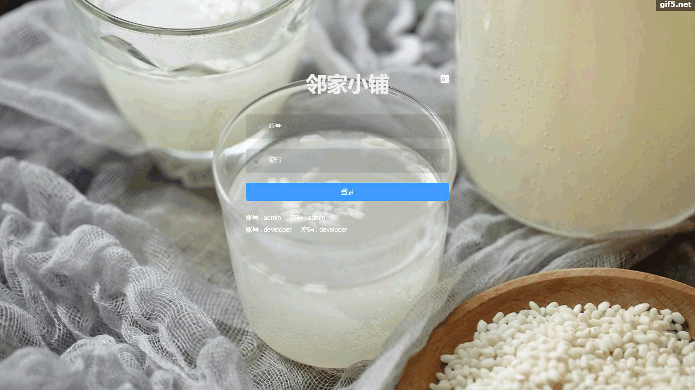
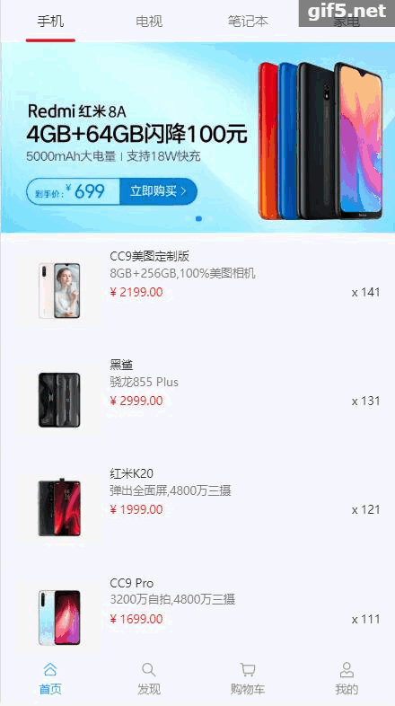

# 启动项目

## 启动后台管理api服务：linjiashop-admin-api
- 右键直接运行cn.enilu.flash.api.AdminApiApplication 类即可已启动后台管理api
- 启动成功后访问http://localhost:8082/swagger-ui.html

## 准备测试图片
- 下载项目测试数据的图片：链接：链接：[https://pan.baidu.com/s/1Ppfgy2wR1nW0l-QMYHFGKw](https://pan.baidu.com/s/1Ppfgy2wR1nW0l-QMYHFGKw) 提取码：wo8q ，将图片存放到t_sys_cfg表中system.file.upload.path配置的目录下；**注意**：该目录路径为绝对路径
## 启动后台管理前端界面：linjiashop-admin
- 进入linjiashop-admin目录
    - 命令行窗口运行 npm install --registry=https://registry.npm.taobao.org
    - 运行  npm run dev
    - 启动成功后访问 http://localhost:9528,登录，用户名密码:admin/admin 
 

## 启动移动端api服务：linjiashop-mobile-api
- 右键直接运行cn.enilu.flash.MobileApiApplication 类即可已启动移动端api服务
- 启动成功后访问http://localhost:8081/swagger-ui.html

## 启动移动端h5界面：linjiashop-mobile
- 进入linjiashop-mobile目录
    - 命令行窗口运行 npm install --registry=https://registry.npm.taobao.org
    - 运行  npm run dev
    - 启动成功后访问 http://localhost:8080
  
 
## 本地调试微信小程序：linjiashop-wxapp
- 进入linjiashop-wxapp目录
    - 命令行窗口运行 npm install --registry=https://registry.npm.taobao.org
    - 运行  npm run dev
    - 在微信开发工具中导入目录：linjiashop-wxapp/dist/wx目录即可  
so，是不是很简单!
